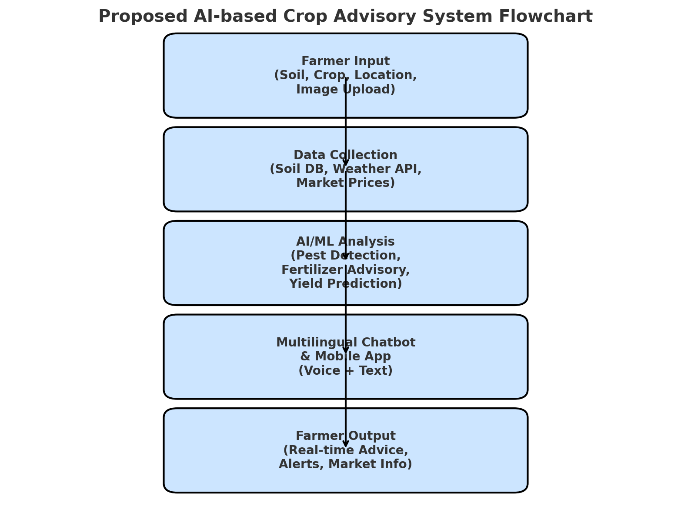

# Smart India Hackathon Workshop
# Date:
## Register Number:
## Name:
## Problem Title
SIH 25010: Smart Crop Advisory System for Small and Marginal Farmers
## Problem Description
A majority of small and marginal farmers in India rely on traditional knowledge, local shopkeepers, or guesswork for crop selection, pest control, and fertilizer use. They lack access to personalized, real-time advisory services that account for soil type, weather conditions, and crop history. This often leads to poor yield, excessive input costs, and environmental degradation due to overuse of chemicals. Language barriers, low digital literacy, and absence of localized tools further limit their access to modern agri-tech resources.

Impact / Why this problem needs to be solved

Helping small farmers make informed decisions can significantly increase productivity, reduce costs, and improve livelihoods. It also contributes to sustainable farming practices, food security, and environmental conservation. A smart advisory solution can empower farmers with scientific insights in their native language and reduce dependency on unreliable third-party advice.

Expected Outcomes

• A multilingual, AI-based mobile app or chatbot that provides real-time, location-specific crop advisory.
• Soil health recommendations and fertilizer guidance.
• Weather-based alerts and predictive insights.
• Pest/disease detection via image uploads.
• Market price tracking.
• Voice support for low-literate users.
• Feedback and usage data collection for continuous improvement.

Relevant Stakeholders / Beneficiaries

• Small and marginal farmers
• Agricultural extension officers
• Government agriculture departments
• NGOs and cooperatives
• Agri-tech startups

Supporting Data

• 86% of Indian farmers are small or marginal (NABARD Report, 2022).
• Studies show ICT-based advisories can increase crop yield by 20–30%.

## Problem Creater's Organization
Government of Punjab

## Theme
Agriculture, FoodTech & Rural Development

## Proposed Solution
<ul><li>A majority of small and marginal farmers in India rely on traditional knowledge, local shopkeepers, or guesswork for crop selection, pest control, and fertilizer use. They lack access to personalized, real-time advisory services that account for soil type, weather conditions, and crop history. This often leads to poor yield, excessive input costs, and environmental degradation due to overuse of chemicals. Language barriers, low digital literacy, and absence of localized tools further limit their access to modern agri-tech resources.
</li>
<h1>How it addresses the problem</h1>
<li>Bridges the gap between farmers and scientific agricultural practices.</li>
<li>Reduces reliance on guesswork and informal advice.</li>
<li>Provides timely information in local languages and formats accessible to low-literate users.</li>
<li>Promotes sustainable practices by avoiding overuse of fertilizers and pesticides.<li>
<h2>Innovation and uniqueness of the solution</h2>
<li>Combines AI + local language voice support for inclusivity.</li>
<li>Integrates weather, soil, and market data in one platform.</li>
<li>Uses image recognition for real-time pest/disease detection.</li>
<li>Offers feedback-driven continuous improvement using farmer data.</li>

</ul>

## Technical Approach
<ul>
<h1>Technologies to be used</h1>
<li>Programming languages: Python, Java/Kotlin (for mobile app)</li>
<li>Frameworks: TensorFlow/PyTorch (AI models), React Native/Flutter (cross-platform app)</li>
<li>Backend: Node.js/Django, Cloud (AWS/Azure/Google Cloud</li>
<li>Databases: PostgreSQL, Firebase</li>
<li>APIs: Weather APIs, government soil/market data APIs</li>
<h2>Methodology and process for implementation</h2>
<li>1. Data Collection & Integration – Soil, weather, crop history, pest/disease datasets.</li>
<li>
2. AI Model Development – Predictive models for fertilizer use, yield, and pest recognition.</li>
<li>3. App Development – Mobile-first design with voice support and multilingual interface.</li>
<li>4. Pilot Testing – In selected Punjab villages with farmer cooperatives.</li>
<li>5. Feedback & Scaling – Continuous improvements based on usage data.</li>
</ul>

## Feasibility and Viability
<ul>
<h1>Analysis of feasibility</h1>
<li>High smartphone penetration and government support for agri-tech adoption.</li>
<li>Cloud infrastructure ensures scalability at low cost.</li>
<li>Partnerships with agriculture departments and NGOs improve reach.</li>
<h2>Potential challenges and risks</h2>
<li>Low digital literacy among farmers</li>
<li>Data accuracy (soil tests, weather reports)</li>
<li>Resistance to adopting new technology</li>
<h3>Strategies for overcoming challenges</h3>
<li>Provide voice-based and offline support for low-literacy users.</li>
<li>Partner with local agriculture officers for farmer training.</li>
<li>Establish trust through village demonstrations and community champions.</li>
</ul>

## Impact and Benefits
<ul>
<li>Potential impact on the target audience</li>
<li>Farmers receive timely, scientific guidance in an accessible manner.</li>
<li>Increased crop yield and reduced input costs.</li>
<li>Improved decision-making and resilience to climate changes.</li>
<h1>Benefits of the solution</h1>
<li>Social: Empowerment of small farmers, reduced dependency on middlemen.
</li>
<li>Economic: Better yields, cost savings, improved incomes</li>
<li>Environmental: Reduced overuse of chemicals, sustainable farming practices.</li>

</ul>

## Research and References
<ul>
<li>
NABARD Report (2022): 86% of Indian farmers are small or marginal.</li>
<li>FAO & World Bank studies on ICT-enabled agriculture.</li>
<li>Research on AI-based pest detection and soil health monitoring.</li>
<li>Government of India – Soil Health Card Scheme, Agri-Stack initiatives</li>
</ul>
